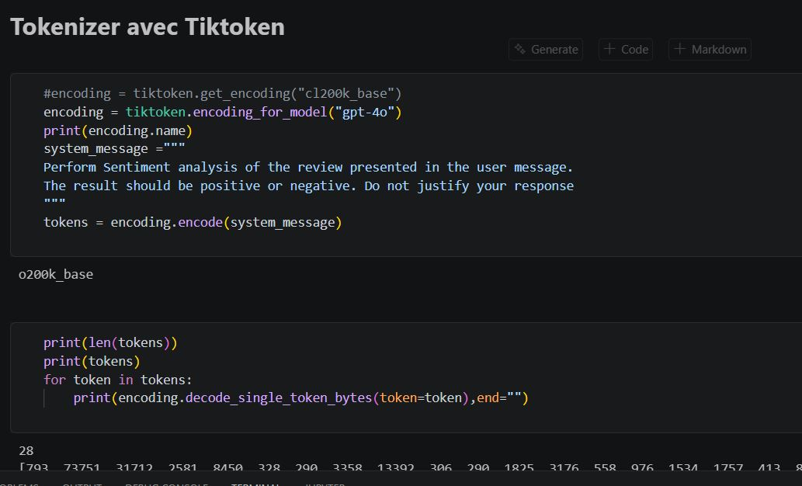
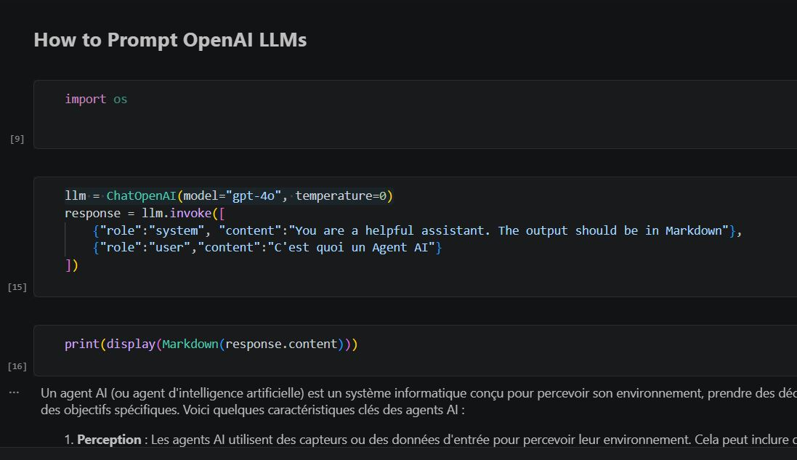
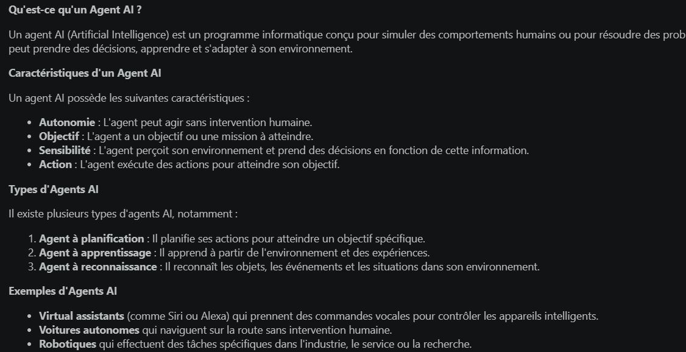
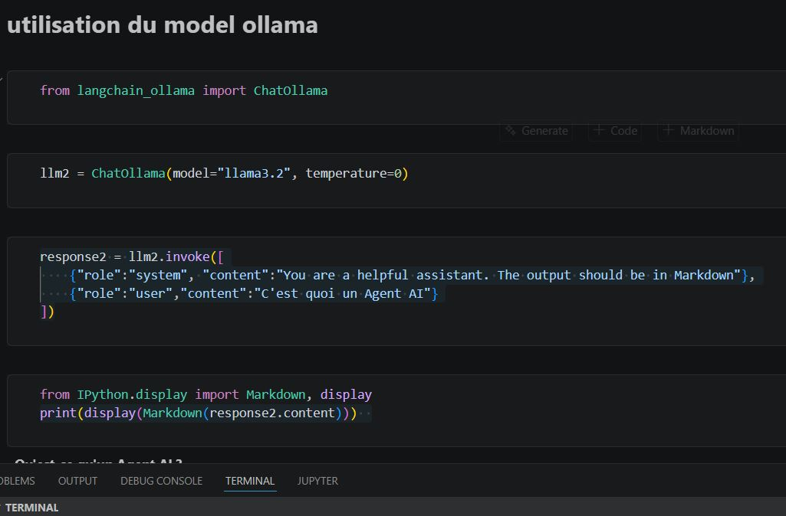
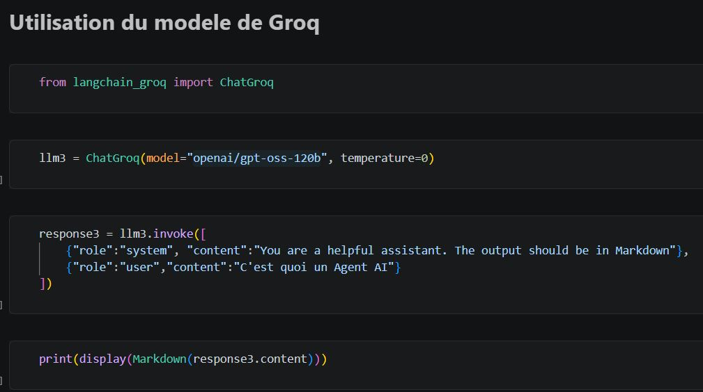
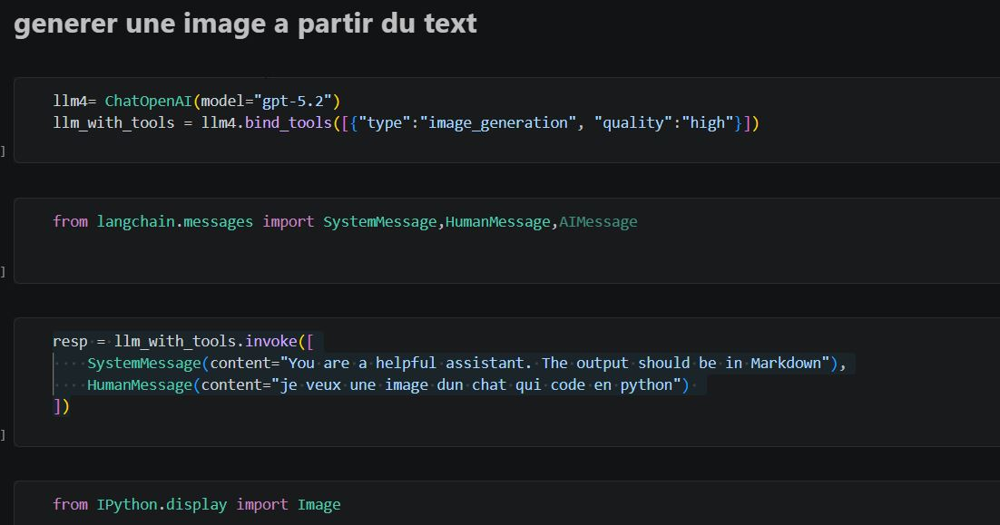
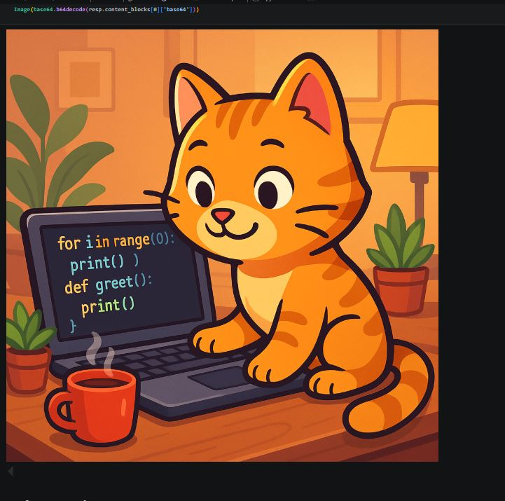

# TP1 — Prompt Engineering for Multi-Agent Systems

Ce notebook couvre les bases du prompt engineering appliqué aux systèmes multi-agents, en utilisant plusieurs LLMs (OpenAI, Ollama, Groq) via LangChain.

---

## Contenu du TP

### 1. Tokenisation avec Tiktoken
Utilisation de la bibliothèque `tiktoken` pour comprendre comment un LLM découpe le texte en tokens avant de le traiter.



---

### 2. Prompting OpenAI (GPT-4o)
Interaction avec le modèle `gpt-4o` via LangChain pour poser des questions et obtenir des réponses en Markdown.



Exemple de réponse sur la définition d'un Agent AI :



---

### 3. Prompting en local avec Ollama (Llama 3.2)
Utilisation d'un modèle local `llama3.2` via `ChatOllama`, sans dépendance à une API externe.



---

### 4. Prompting avec Groq
Utilisation de l'API Groq avec le modèle `openai/gpt-oss-120b` via `ChatGroq` pour des inférences rapides.



---

### 5. Génération d'image à partir du texte
Utilisation d'un LLM multimodal avec l'outil `image_generation` pour générer une image depuis un prompt texte.



Résultat — image d'un chat qui code en Python :



---

### 6. Description d'image (Image → Texte)
Analyse d'une image fournie en entrée et génération d'une description textuelle par le LLM.


---

## Stack technique

| Outil | Rôle |
|-------|------|
| `tiktoken` | Tokenisation |
| `langchain-openai` | Intégration OpenAI (GPT-4o) |
| `langchain-ollama` | Modèles locaux (Llama 3.2) |
| `langchain-groq` | Inférence rapide via Groq |
| `python-dotenv` | Gestion des clés API |
| `uv` | Gestion de l'environnement Python |

## Installation

```bash
uv sync
```

Créer un fichier `.env` à la racine :

```
OPENAI_API_KEY=...
GROQ_API_KEY=...
```

Puis ouvrir `prompt_ingeenering.ipynb` dans Jupyter ou VS Code.
