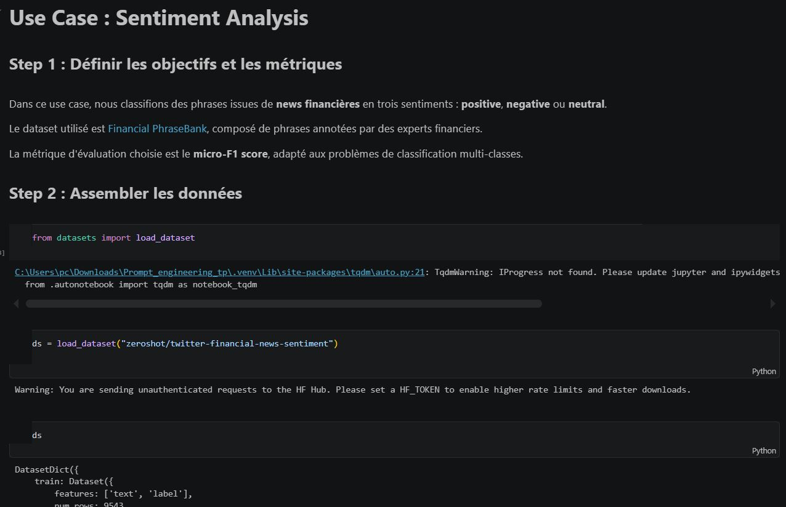
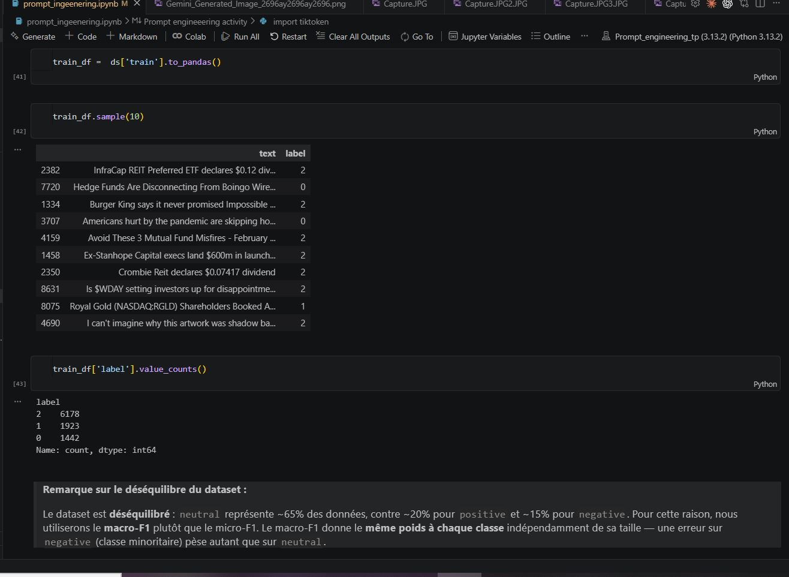
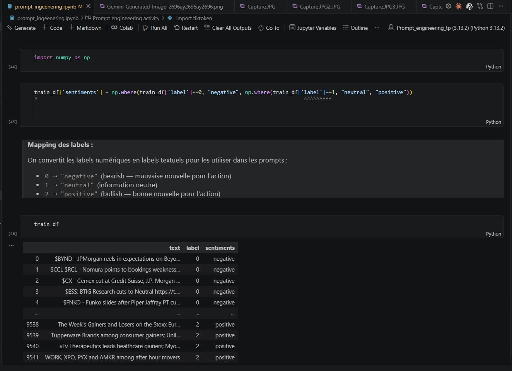
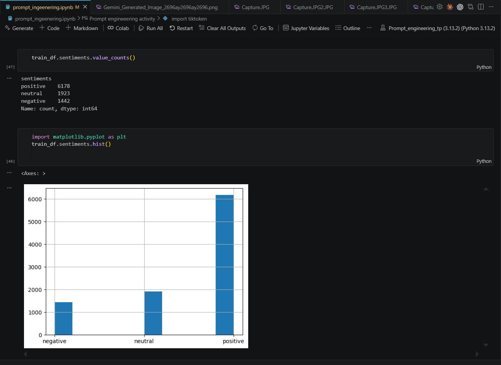
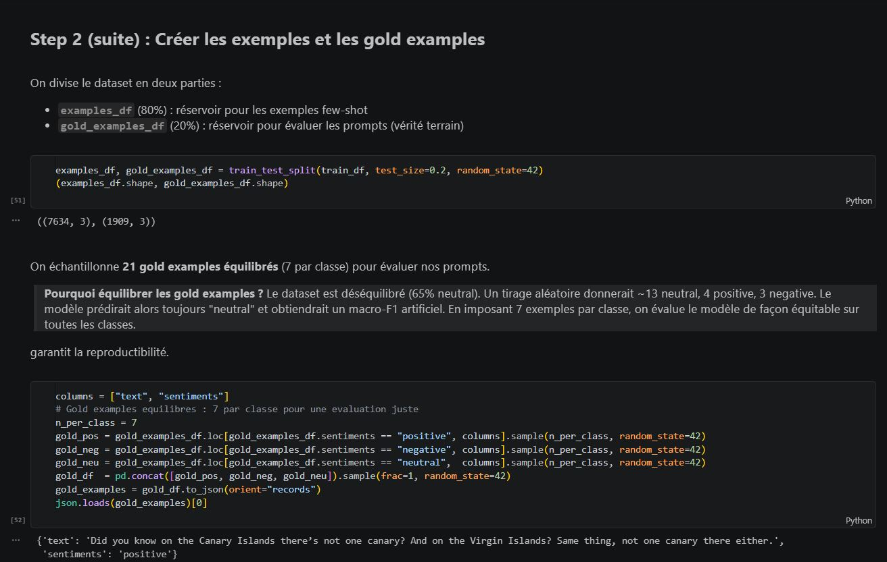
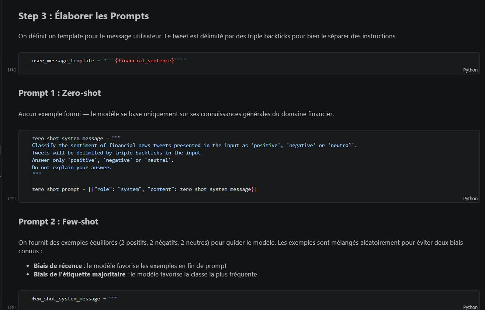
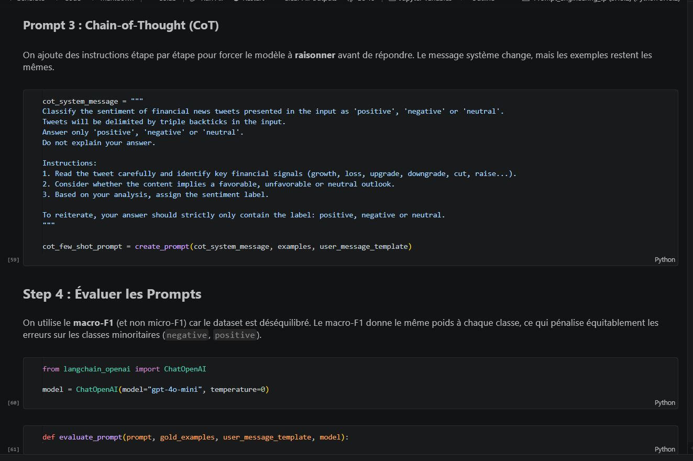
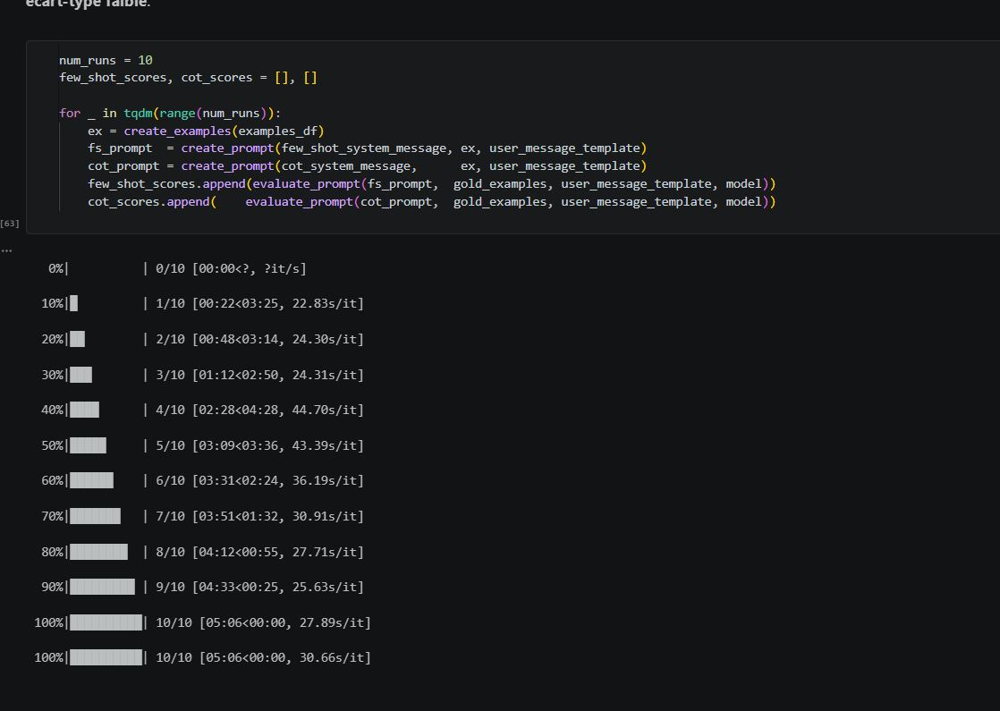
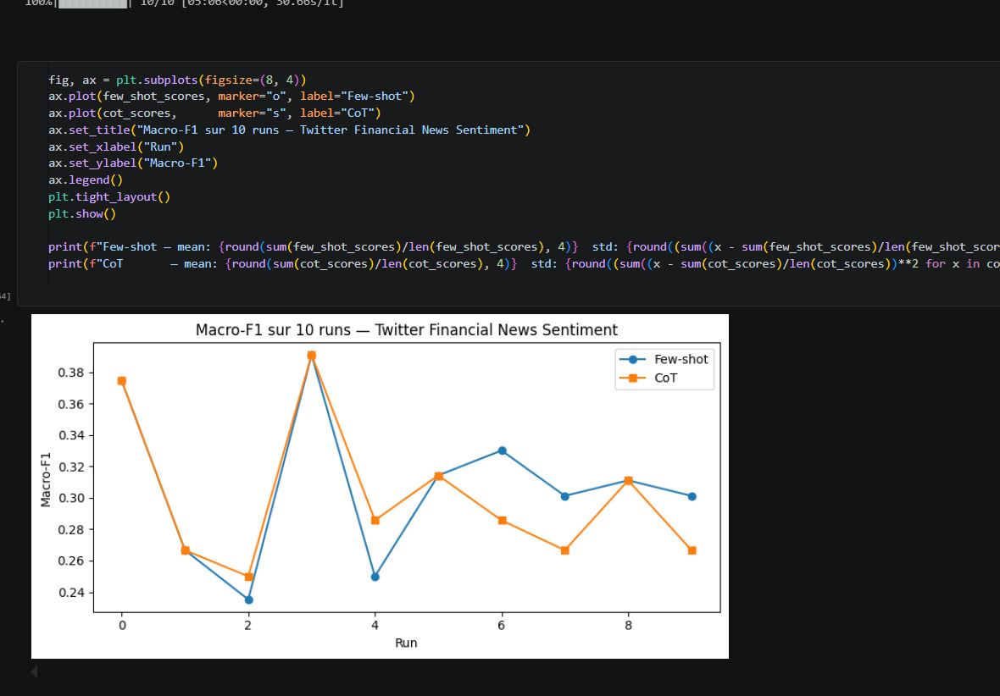

# TP1 — Prompt Engineering for Multi-Agent Systems

Ce notebook couvre les bases du prompt engineering appliqué aux systèmes multi-agents, en utilisant plusieurs LLMs (OpenAI, Ollama, Groq) via LangChain.

---

## Partie 1 : Les fondamentaux

### 1. Tokenisation avec Tiktoken
Utilisation de la bibliothèque `tiktoken` pour comprendre comment un LLM découpe le texte en tokens avant de le traiter.


---

### 2. Prompting OpenAI (GPT-4o)
Interaction avec le modèle `gpt-4o` via LangChain pour poser des questions et obtenir des réponses en Markdown.


Exemple de réponse sur la définition d'un Agent AI :


---

### 3. Prompting en local avec Ollama (Llama 3.2)
Utilisation d'un modèle local `llama3.2` via `ChatOllama`, sans dépendance à une API externe.


---

### 4. Prompting avec Groq
Utilisation de l'API Groq avec le modèle `openai/gpt-oss-120b` via `ChatGroq` pour des inférences rapides.


---

### 5. Génération d'image à partir du texte
Utilisation d'un LLM multimodal avec l'outil `image_generation` pour générer une image depuis un prompt texte.


Résultat — image d'un chat qui code en Python :


---

### 6. Description d'image (Image → Texte)
Analyse d'une image fournie en entrée et génération d'une description textuelle par le LLM.


---

## Partie 2 : Use Case — Sentiment Analysis (Twitter Financial News)

Application de la méthodologie de prompt engineering sur un dataset financier réel pour classifier des tweets boursiers en **positive**, **negative** ou **neutral**.

### Step 1 : Définir les objectifs et les métriques

Dataset : **Twitter Financial News Sentiment** — tweets annotés sur des actualités boursières.
Métrique : **macro-F1** (choisi car le dataset est déséquilibré).



---

### Step 2 : Assembler les données

Analyse de la distribution des labels et remarque sur le déséquilibre du dataset (65% neutral).



Mapping des labels numériques en labels textuels (0→negative, 1→neutral, 2→positive) :



Visualisation de la distribution — déséquilibre clairement visible :



Gold examples **équilibrés** (7 par classe) pour une évaluation juste :



---

### Step 3 : Élaborer les Prompts

Construction des 3 prompts : Zero-shot, Few-shot et Chain-of-Thought.



Prompt Chain-of-Thought avec instructions étape par étape :



---

### Step 4 : Évaluer les Prompts

10 runs d'évaluation pour mesurer la variabilité des scores :



Résultats finaux — Macro-F1 sur 10 runs :



| Prompt | Macro-F1 |
|--------|----------|
| Zero-shot | 0.3143 |
| Few-shot | 0.3910 |
| CoT | 0.3910 |

**Few-shot — mean: 0.2974 std: 0.0237 · CoT — mean: 0.2879 std: 0.0217**

---

## Stack technique

| Outil | Rôle |
|-------|------|
| `tiktoken` | Tokenisation |
| `langchain-openai` | Intégration OpenAI (GPT-4o, GPT-4o-mini) |
| `langchain-ollama` | Modèles locaux (Llama 3.2) |
| `langchain-groq` | Inférence rapide via Groq |
| `datasets` (HuggingFace) | Chargement des datasets |
| `scikit-learn` | Calcul du macro-F1 |
| `python-dotenv` | Gestion des clés API |
| `uv` | Gestion de l'environnement Python |

## Installation

```bash
uv sync
```

Créer un fichier `.env` à la racine :

```
OPENAI_API_KEY=...
GROQ_API_KEY=...
```

Puis ouvrir `prompt_ingeenering.ipynb` dans Jupyter ou VS Code.
